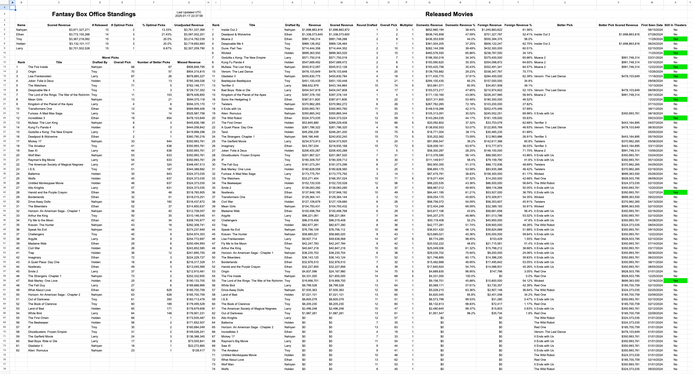

# box-office-tracking

**Tracking a box office draft in a Google Sheet**

This repository is a tool used to track a box office draft in a Google Sheet. It produces a dashboard in the Google Sheet that shows the box office data for the year.

Here is an example of the dashboard:



In this example, I drafted with 4 friends. We did a snake draft, and we each picked 15 movies. There's a concept of "scored revenue," which is the revenue of a movie multiplied by a multiplier. The multipliers are set in the `config.yml` file. You can set a multiplier for a round or a movie. In this example, the revenue of the movies that we drafted in the last round is multiplied by 5 for scoring purposes. You can also set a multiplier for a movie, which is useful if you want to ensure a movie doesn't skew the results too much.

There are 3 main sections of the dashboard:

- **Standings**
  - On the top left, each drafter's name is listed with their scored revenue, as well as the number of movies they drafted that have been released. There's also a column to show how many picks they chose that were optimal, which is a pick that was better than any movie available at the time of that pick.
- **Released Movies**
  - Every movie that has been drafted or is listed in `manual_adds.csv` is listed here.
  - The movies are sorted by scored revenue.
  - On the far right column, there's a flag that shows if the movie is still updating. If no movies are still updating, then the timestamp next to the dashboard will show a message.
- **Worst Picks**
  - The worst picks are listed here, which are the movies that missed out on the most revenue. For example, if you picked a movie first that made \$100 million, and then the next best movie made \$200 million, you missed out on \$100 million.
  - The movies are sorted by the maximum amount of revenue they missed out on.

Throughout the year, I ensure that each movie has the correct title in the `box_office_draft.csv` file. Each movie will only be picked up if it's in the top 200 on the Box Office Mojo Worldwide page.

The way I originally set this up was to scrape the box office data from the Box Office Mojo page each day and store it in an S3 bucket. Then I would read the data from the S3 bucket and load it into the Google Sheet. This is more accurate because it's possible for a smaller movie to show up in the top 200 at one point in time, but then drop out of the top 200 by the end of the year as larger movies get released. I have some logging in the code to record these movies that may have missed revenue.

If you want to do a smaller draft or don't want to set up an S3 bucket, you can choose for a draft to pull from the Box Office Mojo page each time the dashboard is updated. This is easier to set up, but it's not as accurate as the S3 method.

## Configuration

To run your own drafts, you will need a `config.yml` file in the `config` folder. This file should contain an ID for each dashboard you want to update. The top-level tag is `dashboards`, and each ID must include the following keys:

- `name`: Name of the draft.
  - This will be the title of the dashboard.
- `description`: Description of the draft.
  - This isn't used for anything but is useful for you to distinguish between drafts.
- `year`: Release year of movies to be scraped.
  - This is used to determine which Box Office Mojo page to scrape. Only movies released in this year will be added to the dashboard.
- `update_type`: Can be `scrape` or `S3`.
  - `scrape`: Scrapes box office data from [Box Office Mojo](https://www.boxofficemojo.com/year/world/).
  - `S3`: Assumes box office data is already in an S3 bucket and loads it into DuckDB.
- `sheet_name`: Name of the Google Sheet where the dashboard will be written.
- `folder_name`: Name of the folder in the `assets/` folder containing the draft's config files.

Optional keys include:

- `movie_multiplier_overrides`: Adjust the scored revenue multiplier for specific movies.
  - **Key:** `movie`
  - **Key:** `multiplier`
- `round_multiplier_overrides`: Add a specific scored revenue multiplier for a round.
  - **Key:** `round`
  - **Key:** `multiplier`
- `gspread_credentials_name`: Name of the gspread credentials variable in the `.env` file.
  - Defaults to `GSPREAD_CREDENTIALS_<year>`.
- `bucket`: Name of the S3 bucket (and path, if applicable) that contains the box office data.
  - Only needed if `update_type` is `S3`.
- `s3_read_access_key_id_var_name`: Name of the S3 access key id variable in the `.env` file.
  - Only needed if `update_type` is `S3`.
  - This access_key must have read access to the bucket.
  - Defaults to `S3_ACCESS_KEY_ID`.
- `s3_read_secret_access_key_var_name`: Name of the S3 secret access key variable in the `.env` file.
  - Only needed if `update_type` is `S3`.
  - This secret_key must have read access to the bucket.
  - Defaults to `S3_SECRET_ACCESS_KEY`.
- `s3_write_access_key_id_var_name`: Name of the S3 access key id variable in the `.env` file.
  - Only needed if `update_type` is `S3`.
  - This access_key must have write access to the bucket.
  - Defaults to `S3_ACCESS_KEY_ID`.
- `s3_write_secret_access_key_var_name`: Name of the S3 secret access key variable in the `.env` file.
  - Only needed if `update_type` is `S3`.
  - This secret_key must have write access to the bucket.
  - Defaults to `S3_SECRET_ACCESS_KEY`.

For each ID in your `config.yml` file, you will also need:

- A Google Sheet named `sheet_name` with a tab called "Dashboard"
  - This sheet will be used to display the box office data for the year.
  - See below about how to set up access to this sheet.
- The following variables in your `.env` [file](https://onboardbase.com/blog/env-file-guide/):
  - `MODAL_TOKEN_ID` and `MODAL_TOKEN_SECRET`
    - Token ID and secret for the [modal](https://modal.com/) account.
  - `GSPREAD_CREDENTIALS_<year>`
    - Credentials for the Google Sheet that data will be written to for that year. [Here](https://docs.gspread.org/en/latest/oauth2.html#for-bots-using-service-account) is how to generate these credentials and add the account to the Google Sheet.
    - You can change the name of this variable in the `config.yml` file using the `gspread_credentials_name` key, but it defaults to `GSPREAD_CREDENTIALS_<year>`.
  - `S3_ACCESS_KEY_ID` and `S3_SECRET_ACCESS_KEY`
    - Only needed if `update_type` is `S3`.
    - For security, I recommend creating 2 pairs of keys, one for read access and one for write access.
    - You can change the name of these in the `config.yml` file using the `s3_read_access_key_id_var_name`, `s3_read_secret_access_key_var_name`, `s3_write_access_key_id_var_name`, and `s3_write_secret_access_key_var_name` keys, but they default to `S3_ACCESS_KEY_ID` and `S3_SECRET_ACCESS_KEY`.
- A corresponding folder (specified in the `folder_name` key in the `config.yml` file) in `assets/` with the following files:
  - `box_office_draft.csv`
    - Source of truth for the box office draft.
    - **Columns:** round, overall, name, movie
  - `manual_adds.csv`
    - List of movies that do not show up in the top 200 at the end of the year so they must be added manually.
    - **Columns:** title, revenue, domestic_rev, foreign_rev, release_date

If any of your dashboards have an `update_type` of `S3`, the script will run an ETL process to load the data from Box Office Mojo into your bucket. If you registered a modal account, S3 bucket, and have the correct keys in your `.env` file, the script will update the data in the bucket every day at 4am UTC.

Here is an example of the `config/config.yml` file:

```yaml
dashboards:
  my_2025_draft:
    name: 2025 Fantasy Box Office Standings
    description: Draft with Holden, Troy, Nahiyan, and Larry for 2025
    year: 2025
    update_type: s3
    sheet_name: 2025 Fantasy Box Office Draft
    folder_name: my_2025_draft_data
    movie_multiplier_overrides:
      - movie: "Avatar: Fire and Ash"
        multiplier: 0.5
    round_multiplier_overrides:
      - round: 20
        multiplier: 5
    gspread_credentials_name: GSPREAD_CREDENTIALS_FRIENDS_2025
    # The following are only needed if update_type is s3
    bucket: box-office-tracking
    s3_write_access_key_id_var_name: S3_WRITE_ACCESS_KEY_ID_MY_2025_DRAFT
    s3_write_secret_access_key_var_name: S3_WRITE_SECRET_ACCESS_KEY_MY_2025_DRAFT
    s3_read_access_key_id_var_name: S3_READ_ACCESS_KEY_ID_MY_2025_DRAFT
    s3_read_secret_access_key_var_name: S3_READ_SECRET_ACCESS_KEY_MY_2025_DRAFT
```

## Set Up

1. Download this repo, either by cloning it or downloading the zip file.
2. Set up a [modal](https://modal.com/) account.
3. (Optional) Set up a S3 bucket to store the box office data. I like to use [Digital Ocean Spaces](https://www.digitalocean.com/products/spaces).
4. Create a google sheet with a tab called "Dashboard". Follow this guide to [set up APIaccess to this sheet](https://docs.gspread.org/en/latest/oauth2.html#for-bots-using-service-account).
5. Create a `.env` file in the root directory that follows the format above.
6. Create a `config/config.yml` file in the root directory that follows the format above.
7. Add your draft data to the `assets/<folder_name>` folder. See the section above to follow the format for these files.
8. If you want to run the script locally, you can do so by installing python and running `poetry install` and then `poetry run python sync_and_update.py`.

## Deployment

To deploy the `sync_and_update.py` script, use the provided shell script `deploy_modal.sh`. This script automates the deployment process using Poetry and Modal.

### Prerequisites

- Ensure that both `poetry` and `modal` are installed and available in your system's PATH.

## Usage

1. **Make the Script Executable**: If you haven't already, make the script executable:
   ```bash
   chmod +x deploy_modal.sh
   ```

2. **Basic Deployment**: Run the following command to deploy the script:
   ```bash
   ./deploy_modal.sh
   ```

3. **Add .env file to modal secrets**: Go to your app on modal.com and add your `.env` file to a new secret called `box-office-tracking-secrets`.

The S3 sync updates the data in the bucket every day at 4am UTC, and the dashboard is updated every day at 5am UTC.
